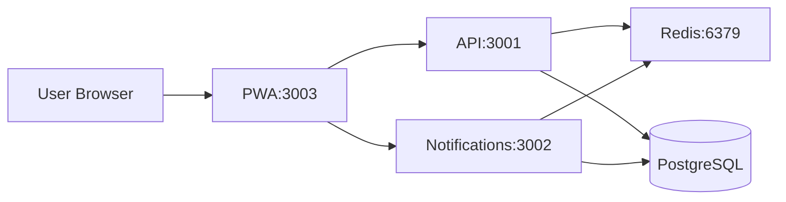
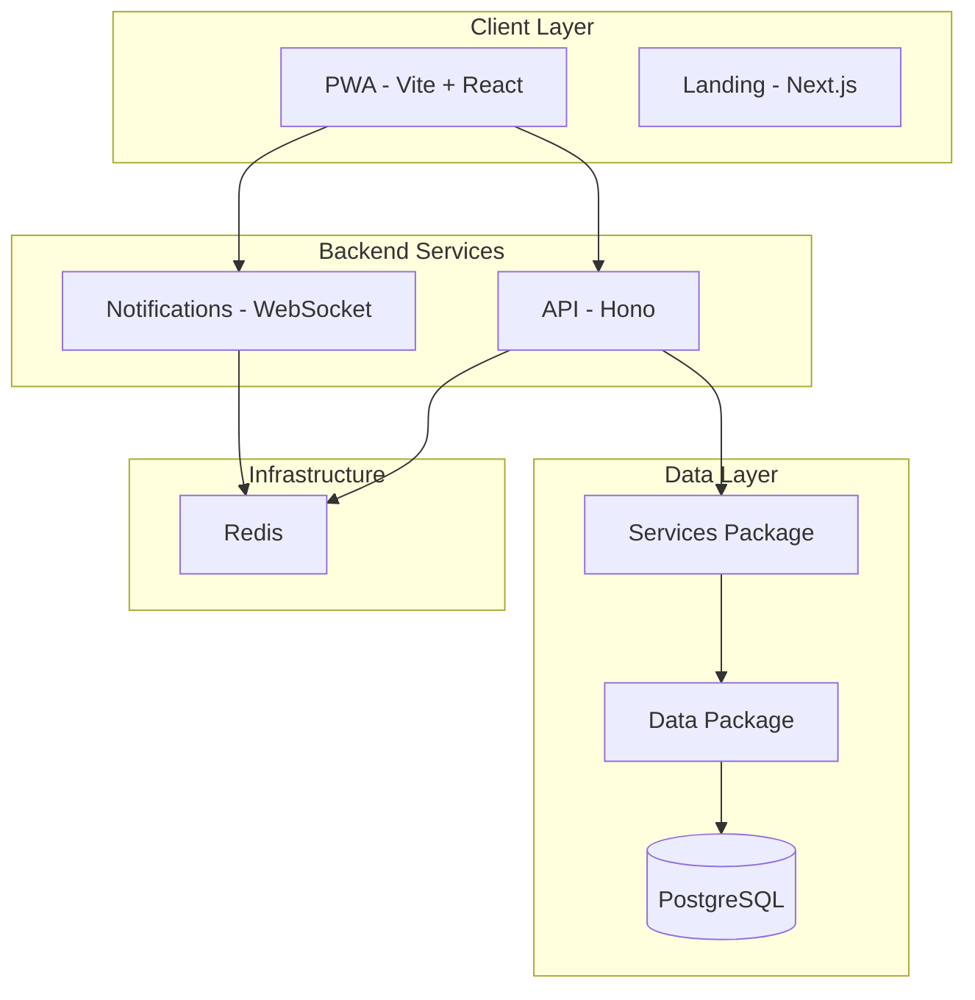

# Tab

Split expenses with friends. Open source, self-hostable, and built for the long run.

Tab is a Splitwise alternative that puts you in control. Your data stays on your server. No paywalls, no feature limits, no surprises. Run it yourself or contribute to make it better.

## Hosted Version

**A fully free**, donations-supported instance is available at [TabIt.in](https://tabit.in). No paywalls, no paid-only features. Free forever, as a way of giving back to the open source community. If it helps you, consider [supporting](https://paypal.me/parthk).

## Why Tab?

Commercial expense-splitting apps can change the rules overnight. Free tiers get restricted. Features move behind paywalls. Your years of expense history become leverage.

**Tab is different.**

- **Your data, your server** - Self-host and your expenses never leave your infrastructure. No third party has access to your financial data.

- **No vendor lock-in** - Open source means you are never at the mercy of pricing changes or policy shifts. The code is yours to run, fork, and modify.

- **Transparency** - You can read the code, audit the logic, and know exactly what is running. No black boxes.

- **Community-driven** - Features are built by users, for users. Report issues, suggest improvements, or contribute code. The project improves when the community contributes.

- **Run it forever** - Even if the maintainers move on, the source remains. You or any developer can keep it running. No one can take it away.

## Features

### Core Splitting

- [x] 1-on-1 and group expense tracking
- [ ] Multiple split types: equal, custom amounts, percentages
- [ ] Multi-currency support per tab
- [x] Splitwise CSV import
- [x] Expense audit logs

### Modern Experience

- [x] Progressive Web App (install on iOS, Android, desktop)
- [x] AI-powered voice expense entry
- [x] Real-time notifications via WebSocket
- [x] Offline-first with IndexedDB persistence
- [x] Emoji reactions on expenses

### Social and Collaboration

- [x] QR code invites for friends and tabs
- [x] Poke friends for fun
- [x] Sort friends and tabs by name, recency, or activity

### Privacy and Control

- [x] Self-hostable
- [x] Magic link authentication (no passwords to manage)
- [x] Your data stays on your server

## Quick Start

For local development:

**Prerequisites:** Node.js 24+, pnpm, PostgreSQL, Redis

```bash
# 1. Install dependencies
pnpm install

# 2. Build shared packages
pnpm build --filter=models --filter=db

# 3. Configure environment
cp .env.example .env
# Edit .env with DATABASE_URL, BETTER_AUTH_SECRET, PLUNK_SECRET_KEY, CORS_ORIGIN, etc.

# 4. Run migrations
cd packages/db && pnpm db:push

# 5. Start dev servers
pnpm dev

# 6. Run tests
pnpm test
```

The app runs at:

- PWA: http://localhost:3003
- API: http://localhost:3001
- Notifications WebSocket: ws://localhost:3002

## Self-Hosting with Docker Compose

Deploy Tab on your own infrastructure. You provide PostgreSQL; Docker Compose runs the rest.

### Prerequisites

- Docker and Docker Compose
- PostgreSQL database (managed service like Neon, Supabase, or self-hosted)
- Email service for magic links (Plunk, Resend, or similar)
- Domain name (optional but recommended for production)

### Step 1: Clone and Configure

```bash
git clone https://github.com/parthkoshti/tabit.git
cd tabit
cp .env.example .env
```

### Step 2: Set Environment Variables

Edit `.env` with your values. Required variables:

| Variable                    | Description                                    |
| --------------------------- | ---------------------------------------------- |
| `DATABASE_URL`              | PostgreSQL connection string                   |
| `BETTER_AUTH_SECRET`        | Secret for auth (min 32 characters)            |
| `BETTER_AUTH_URL`           | Your PWA URL (e.g. https://app.yourdomain.com) |
| `PLUNK_SECRET_KEY`          | Plunk API key for magic link emails            |
| `PLUNK_BASE_URL`            | Plunk API base URL                             |
| `CORS_ORIGIN`               | Allowed origins for API (your PWA URL)         |
| `NEXT_PUBLIC_PWA_URL`       | Public PWA URL (same as BETTER_AUTH_URL)       |
| `VITE_NOTIFICATIONS_WS_URL` | WebSocket URL (e.g. wss://ws.yourdomain.com)   |

Redis is included in the compose stack. `REDIS_URL` is set automatically for the api and notifications services.

Optional: `VAPID_PUBLIC_KEY`, `VAPID_PRIVATE_KEY` for web push; `GOOGLE_GENERATIVE_AI_API_KEY` for AI expense parsing.

### Step 3: Start the Stack

```bash
docker compose up -d
```

The API container runs database migrations on startup. Services start in order: Redis, API, notifications, PWA.

### Step 4: Access the App

The compose file exposes services on an internal network. To access the PWA:

**Option A: Reverse proxy (recommended for production)**

Place Caddy or Nginx in front. Route your domain to:

- PWA: `pwa:3003`
- API: `api:3001` (proxy `/api/auth` and `/api/*`)
- WebSocket: `notifications:3002` (for `wss://`)

**Option B: Port mapping (local testing)**

Add to `docker-compose.yml` under the `pwa` service:

```yaml
ports:
  - "3003:3003"
```

Then open http://localhost:3003

### Architecture



### Production Considerations

- Use a reverse proxy (Caddy, Nginx) with SSL/TLS
- Set `BETTER_AUTH_COOKIE_DOMAIN` and `BETTER_AUTH_TRUSTED_ORIGINS` for your domain
- Configure backups for PostgreSQL
- Consider `OTEL_*` variables for observability (SigNoz, etc.)

## Development

### Project Structure

Monorepo (Turborepo):

- `apps/pwa` - Main expense app (Vite + React), port 3003
- `apps/api` - Hono REST API, port 3001
- `apps/notifications` - WebSocket server, port 3002
- `apps/web` - Landing page (hosted separately)
- `packages/services` - Business logic
- `packages/data` - Data access layer
- `packages/db` - Drizzle schema and migrations

See [ai/SOUL.md](ai/SOUL.md) for detailed architecture and conventions.

### Commands

```bash
pnpm dev              # Start all services
pnpm test             # Run all tests
pnpm check            # TypeScript check
pnpm lint             # ESLint
pnpm build            # Build for production
```

### HTTPS for Local PWA

```bash
pnpm generate-https-certs   # Requires mkcert
```

## Architecture



- Service layer for business logic (validation, authorization, notifications)
- Data layer for database queries
- Real-time via Redis pub/sub
- PWA with offline-first IndexedDB cache

## Tech Stack

**Frontend**

- React 18 + Vite
- TanStack Query + IndexedDB persistence
- Zustand for UI state
- React Router v7
- PWA with service workers

**Backend**

- Hono (fast, edge-ready)
- Better Auth (magic links only)
- Drizzle ORM + PostgreSQL
- Redis for caching and pub/sub
- Web Push notifications

**Infrastructure**

- Docker + Docker Compose
- Turborepo monorepo
- Vitest for testing
- OpenTelemetry (optional)

**Integrations**

- Google Gemini for AI expense parsing
- Plunk for transactional emails

## Open Source Shoutouts

Tab and related projects (Snitchfeed, Conncord) are built with and deployed using these open source tools:

- [Plunk](https://useplunk.com/) - Open-source email platform for transactional emails, marketing, and automation. Self-hostable, transparent pricing.
- [SigNoz](https://signoz.io) - Open-source observability platform. Logs, traces, and metrics in one place.
- [Dokploy](https://dokploy.com) - Self-hosted PaaS for deploying applications with Docker Compose.
- [Bull Board](https://github.com/felixmosh/bull-board) - Queue background jobs inspector for Bull and BullMQ.

## Contributing

Contributions are welcome. Open an issue to report bugs or suggest features. Pull requests should include tests where applicable.

## License

See the LICENSE file in the repository.
